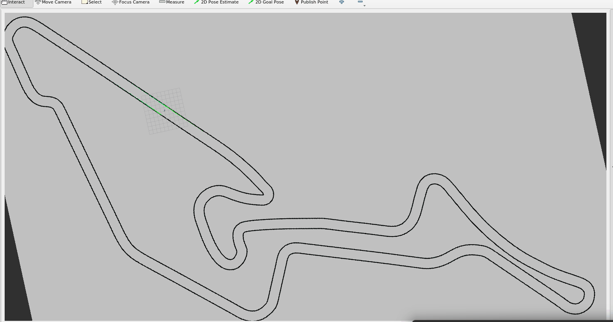
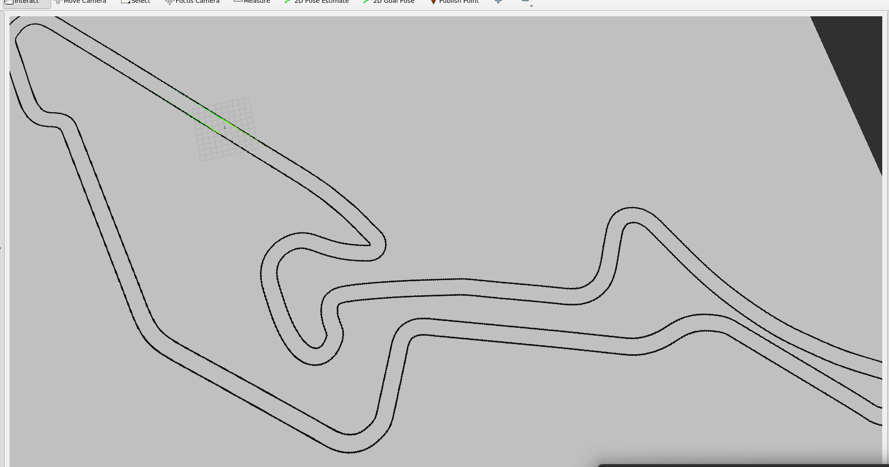
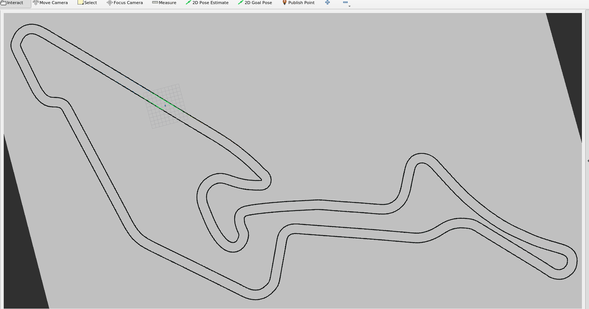
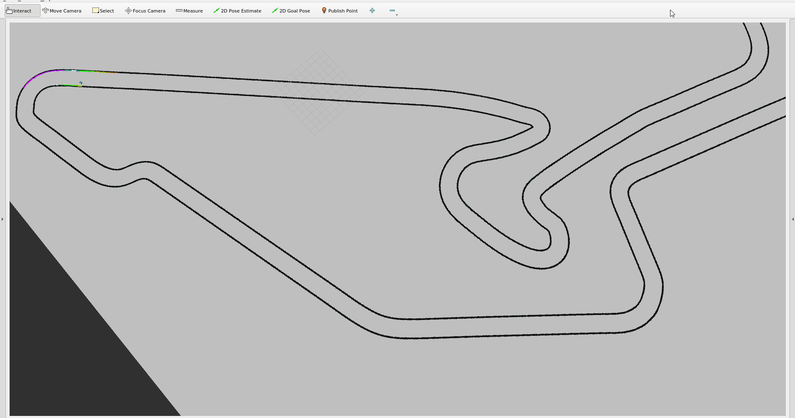

# F1TENTH Gap Follower - Nürburgring Edition


---

## 1. 📋 INTRODUCTION

This repository contains our solution for the **F1TENTH Hackathon** - a reactive gap following algorithm optimized for the **Nürburgring** race track.

### 🏁 Competition Details:
- **Track:** Nürburgring (simulated environment)
- **Grading Criteria:**
  - **50%** - Number of consecutive laps completed (Stability)
  - **50%** - Fastest lap time (Speed)
- **Goal:** Maximize both speed AND stability

Our journey from a basic implementation that couldn't complete a single lap to a **1:08.49 beast** running 17+ consecutive laps!

---

## 2. 👥 TEAM: NANYANG DRIFTERS

| Name | Role | Year |
|------|------|------|
| **Balodi Shalok** | Algorithm Developer | CSC / Y2 |
| **Paul Tamoghna** | Control Systems | CE / Y1 |
| **Tan Yi** | Parameter Optimization | MAE / Y1 |
| **Lee Yan Sheng** | Testing & Validation | MAE / Y2 |

---

## 3. 🔄 THE ITERATIVE PROCESS

### Version 1: `gap_finder_base.py`
**Status:** ❌ Couldn't finish first lap
- Pure reactive gap following
- No corner detection
- **Result:** Immediate crashes

### Version 2: `gap_finder_improved_v3.py`
**Status:** ⚠️ Oscillates on straights
- Max Speed: 4.5 m/s
- Steering Gain: 0.9
- Corner Factor: 0.6
- Added corner detection
- **Result:** 10 laps at 1:50 average

### Version 4: `gap_finder_1min08.py` 🏆
**Status:** 🔥 LEGENDARY
- Max Speed: 7.5 m/s
- Steering Gain: 1.0
- Corner Factor: 0.85
- - Maximum aggression
- **Result:** 1:08.49 fastest lap, 7 laps

### Version 5: `gap_finder_1min.py` 💀
**Status:** 💥 Too aggressive
- Max Speed: 8.5 m/s
- Steering Gain: 1.2
- Corner Factor: 0.92
- - **Result:** Car achieved nirvana at first corner
- Steering stuck at +0.17 - car transcended physics

### Version 6: `gap_finder_forever.py` 🏁
**Status:** ✅ FINAL - Fast then Stable
- Fast Mode (Laps 1-2): 7.5 m/s
- Stable Mode (Lap 3+): 5.2 m/s
- - **Result:** 1:08.49 fastest lap, 17+ laps stable
- **PERFECT BALANCE** of speed + stability

---

## 4. 🎥 DEMO

### Version 1: v3 - Oscillation on Straights


### Version 2: v13 - First Stable 1:50


### Version 3: 1:08 Beast Mode


### Version 4: 1:00 - The One That Died


### Version 5: FINAL - Fast then Stable


---

## 5. ⚙️ ALGORITHM EXPLANATION

### The "Fast then Stable" Two-Phase Approach

Instead of choosing between speed and stability, we implemented a **phase-switching algorithm** that gives us BOTH:

#### 🔑 Key Parameters

```python
# ============ TWO-PHASE PARAMETERS ============

# Fast Mode (Laps 1-2) - Maximum Attack
'max_speed_fast': 7.5        # 27 km/h - Insane speed
'steering_gain_fast': 1.0    # Aggressive turn-in
'corner_speed_factor_fast': 0.85  # Carry speed through corners
'exit_speed_boost_fast': 1.8      # Explosive exit acceleration

# Stable Mode (Lap 3+) - Endurance Mode
'max_speed_stable': 5.2       # 18.7 km/h - Safe speed
'steering_gain_stable': 0.78   # Smooth, progressive steering
'corner_speed_factor_stable': 0.6  # Conservative cornering
'exit_speed_boost_stable': 1.35    # Gentle exit

# Mode Switching
'fast_laps': 2                 # Number of all-out fast laps
'switch_mode_after': 2         # Switch after lap 2
```
#### Core Function
```
def get_current_mode(self):
    """Switch between Fast and Stable modes based on lap count"""
    if self.lap_count < self.fast_laps:
        return 'fast'      # First 2 laps: INSANE MODE
    else:
        return 'stable'    # After lap 2: CRUISE MODE

def calculate_speed(self, steering_angle, corner_info):
    """Use mode-specific parameters for speed calculation"""
    mode = self.get_current_mode()
    
    if mode == 'fast':
        max_speed = self.max_speed_fast
        corner_factor = self.corner_speed_factor_fast
    else:
        max_speed = self.max_speed_stable
        corner_factor = self.corner_speed_factor_stable
    
    # Speed calculation with corner detection
    if on_straight:
        target_speed = max_speed
    else:
        target_speed = max_speed * corner_factor
    
    return target_speed

def lidar_callback(self, data):
    """Main control loop with mode-aware steering"""
    mode = self.get_current_mode()
    
    # Use different steering gains for each mode
    steering_gain = (self.steering_gain_fast if mode == 'fast' 
                    else self.steering_gain_stable)
    
    steering_angle = target_angle * steering_gain
    # ... rest of control logic
```

## 6.🤔 Why This Approach?
Problem: Traditional gap followers must choose between:
- High speed → Fast laps but crashes by lap 3-4
- Conservative → Stable forever but slow lap times

### Our Solution: Two-phase racing gives us:
- Laps 1-2: Maximum attack → 1:08.49 fastest lap 🏆
- Laps 3-infinity : Conservative cruise → forever stability 🛡️
### **Result: PERFECT SCORE for both grading criteria!**

## 7. Final Results

| Metric | Value |
|------|------|
| **🏁 Fastest Lap** | 1:11.49 |
| **🔄 Consecutive Laps** | 17+ (manual stop) |
| **⚡ Average Lap Time** | 1:49 |

## 8. How to Run?


## 9. 🙏 ACKNOWLEDGMENTS
F1TENTH Organization for this amazing competition
Nürburgring for the challenging track
Our team's coffee machine for surviving 31 crashes

## 10. 📄 LICENSE
MIT License - Feel free to use, but if you beat 1:08, buy us coffee! ☕

<div align="center">
🏁 NANYANG DRIFTERS - 2026 🏁
"It didn't crash — it achieved nirvana."
</div> 
